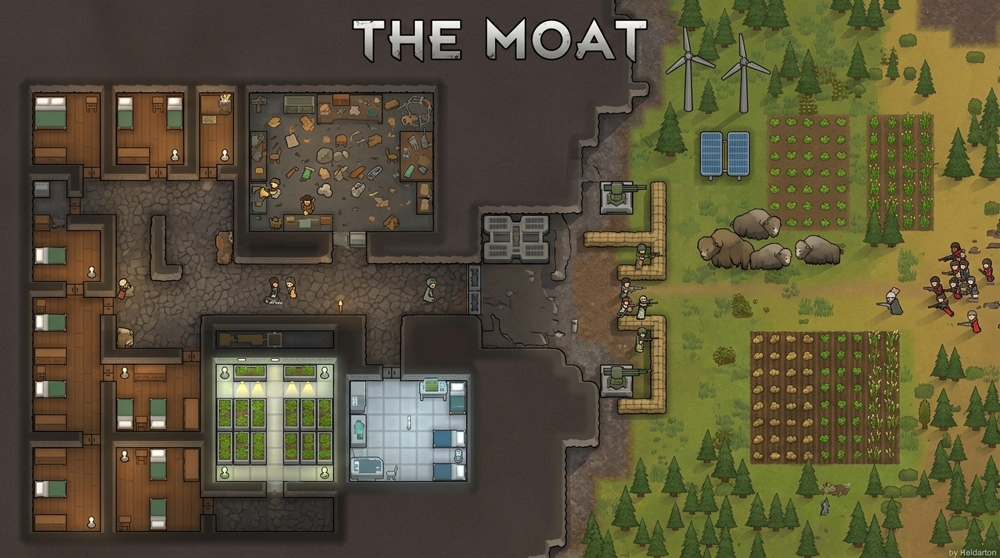

# The Moat

<p align="center">
  
</p>

<p align="center">
  <strong>A RimWorld mod for players who love subterranean fortresses, single chokepoints, and surviving under siege.</strong>
</p>

<p align="center">
  <a href="https://steamcommunity.com/sharedfiles/filedetails/?id=3813355538"></a>
  
  
  <a href="https://github.com/federicogiorgi/TheMoat"></a>
</p>

---

## The Vision: A Cozy Mountain to Defend

**The Moat** is designed specifically for players who want to play a subterranean colony, heavily relying on the supreme defensive capabilities of living under a mountain:

- **Single Choke Point:** Force every raid, manhunter pack, and mechanoid swarm to funnel into a single, fortified entrance. Build your bunker, firing lines, turrets, and killboxes exactly where you want them.
- **No Aerial Drop Pod Raids:** The entire mountain half is sheltered under thick overhead mountain (`RoofRockThick`). No surprise drop pods punching through the roof into your hospital, bedrooms, or storage!
- **Concentrated Defenses:** Forget 360-degree perimeter paranoia. Focus 100% of your firepower, walls, and traps on the entrance facing the untamed wild.
- **The Ultimate Siege Fantasy:** Experience the thrill of being besieged inside a cozy, self-sustaining mountain stronghold while danger roams the open world outside.

---

## Map Generation Layout

When you generate your starting colony map, **The Moat** splits the map into two distinct worlds:

```
+-----------------------------------+-----------------------------------+
|                                   |                                   |
|       WEST (LEFT HALF):           |       EAST (RIGHT HALF):          |
|                                   |                                   |
|   - 100% Solid Mountain Rock      |   - Flat Open Plains              |
|   - NO Caves or Hollow Spots      |   - Farmlands, Trees & Pastures   |
|   - No Ruins/Shrines (Except Ores)|   - Geysers, Ruins & Monolith     |
|   - Mineable Ore Veins (Config)   |   - Colonists & Pods Arrive Here  |
|                                   |                                   |
|             FORTRESS              |           WILDERNESS              |
+-----------------------------------+-----------------------------------+
                                      ^
                                  Chokepoint
                                   Entrance
```

### 1. West Half (The Mountain Fortress)
- **100% Solid Rock Barrier:** The left 50% of the map is packed solid with natural rock walls.
- **True Overhead Mountain:** Complete `RoofRockThick` coverage preventing all overhead drop-pod insertions.
- **Zero Caves & Hollow Pockets:** Guaranteed no hidden caverns, no insect nest pockets waiting to be uncovered, and no secret rear exits.
- **No Special Features (Except Ores):** Shrines, ancient dangers, steam geysers, ruins, and monoliths are strictly prohibited from spawning inside the mountain, giving you clean rock to carve your halls. The only exception is **mineable ore veins**, which can still be found and spawn throughout the rock by default so your miners have plentiful resources to unearth.
- **Mountain-Level Ore Density:** Ore lumps are topped up to roughly the density of a vanilla mountainous map, even on flat tiles.

### 2. East Half (The Untamed Wilderness)
- **Flat Open Land:** Mountains and rocky hills are cleared away, giving you wide-open expanses for agriculture, windmills, solar arrays, and pastures.
- **No Obstructive Lakes:** Swamps and deep lakes are dried into arable soil matching local biome fertility.
- **Full Vanilla Features:** Soil varieties, rich soil, wild trees, grazing animals, steam geysers, ancient dangers, ruins, roads, and the Anomaly Void Monolith spawn cleanly across the plains.
- **Safe Player Landing:** Colonists, cargo pods, and starting gear always touch down safely on the open plains.

### 3. Starting Colony Only
- **The Moat affects ONLY your initial starting colony map.**
- Future satellite colonies, quest locations, ancient complexes, hunting grounds, and campsite maps generate with completely normal vanilla terrain!

---

## Mod Settings

Customizable via **Options &rarr; Mod Settings &rarr; The Moat**:

- **Mountain Width Slider:** Adjust the width of the mountain barrier (from 30% up to 70% of the map width, default: **50%**).
- **Allow Ore Veins in the Mountain:** Toggle whether mineable resources spawn inside the rock wall (default: **ON**).
- **Remove Lakes on Plains:** Converts impassable water bodies into dry, buildable land (default: **ON**).
- **Flatten Hills on Plains:** Removes minor rock formations and hills from the plains (default: **ON**).

---

## Requirements & Compatibility

- **[Harmony](https://steamcommunity.com/sharedfiles/filedetails/?id=2009463077)** is **REQUIRED**.  
  Make sure Harmony is loaded at the top of your mod list (before Core and before The Moat).
- **No DLCs or other mods required!** Fully compatible with pure vanilla RimWorld, all official DLCs (Biotech, Ideology, Royalty, Anomaly), and extensive third-party modlists.
- Compatible with RimWorld **1.6**.
- Safe to add to existing games (takes effect on new games or new colony map generations).

---

## Installation & Links

- **Steam Workshop:** [Subscribe to The Moat on the Steam Workshop](https://steamcommunity.com/sharedfiles/filedetails/?id=3813355538)
- **GitHub Repository:** [federicogiorgi/TheMoat](https://github.com/federicogiorgi/TheMoat)

### How to Install & Play

1. Subscribe to [The Moat on the Steam Workshop](https://steamcommunity.com/sharedfiles/filedetails/?id=3813355538).
2. Ensure you are also subscribed to [Harmony](https://steamcommunity.com/sharedfiles/filedetails/?id=2009463077).
3. In RimWorld, navigate to the **Mods** menu:
   - Enable **Harmony** (placed above Core / at the top of your mod list).
   - Enable **The Moat**.
4. Click **Close** to reload mods.
5. Start a **New Game** on any world tile. Your colonists will touch down on the open plains facing the sheer mountain fortress to their west!

### Manual Installation
1. Download or clone this repository: `git clone https://github.com/federicogiorgi/TheMoat.git`
2. Place the `TheMoat` folder into your RimWorld mods directory:
   - Windows: `<Steam>/steamapps/common/RimWorld/Mods/TheMoat`
3. Launch RimWorld and enable Harmony and The Moat in the Mods menu.

---

## How to Update the Mod on Steam Workshop

RimWorld tracks Workshop updates using [`About/PublishedFileId.txt`](About/PublishedFileId.txt) (Workshop Item ID: `3813355538`).

Whenever you want to release an update:
1. Make your code or asset changes in your local mod directory.
2. In RimWorld, go to **Options** and make sure **Development mode** is enabled (green ✔️).
3. Open **Mods**, select **The Moat**, and click **`[Advanced...]`**.
4. Click **"Upload to Steam Workshop"**.
5. RimWorld reads `PublishedFileId.txt`, recognizes that the item already exists, and pushes your changes directly as an **update** to the existing Workshop page, prompting you for changelog notes!

---

*“Dig deep, fortify the gate, and let the rimworld break against the stone.”*
